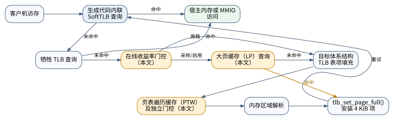

# 全系统模拟器MMU不命中路径自适应优化

# Adaptive Optimization of MMU Miss Handling in Full-System Emulators

## 摘要

针对全系统动态二进制翻译器中内存管理单元（MMU）不命中处理开销较高的问题，
本文提出大页转换缓存、非叶页表缓存及自适应收益门控。新增结构仅在主软件转换
后备缓冲器和牺牲缓冲器均未命中后启用，不增加命中路径指令。固定4096项主缓冲器
并关闭牺牲缓冲器时，大页缓存和页表缓存在微基准上的加速比分别为
1.397和1.065。在7个固定工作量应用中，大页缓存和组合方案的几何平均
加速比分别为1.142和1.135，嵌套虚拟化内层负载的最高加速比为2.304，429.mcf
的组合方案加速比为1.137。自适应组合方案在固定容量429.mcf上取得1.212倍加速，
并在无大页复用的负对照中旁路85.7%的候选查询。实验表明，所提方法能够利用
地址转换覆盖后的剩余局部性；在默认软件配置和部分应用中尚未获得加速，仍需结合
负载特征及硬件辅助异构虚拟化平台进一步研究。

**关键词：** 全系统模拟；动态二进制翻译；软件转换后备缓冲器；大页；页表遍历；
自适应缓存；地址转换

## Abstract

Memory-management-unit (MMU) miss handling remains costly in full-system
dynamic binary translators. This paper presents a large-page translation
cache, a non-leaf page-table cache, and an adaptive benefit controller. The
new structures are accessed only after both the primary software translation
lookaside buffer and its victim buffer miss, leaving the common hit path
unchanged. With a fixed 4096-entry primary buffer and no victim buffer, the
large-page and page-table caches achieve speedups of 1.397 and 1.065 on their
respective microbenchmarks. Across seven fixed-work applications, the
geometric-mean speedups of the large-page and combined schemes are 1.142 and
1.135, and the inner nested-virtualization workload reaches 2.304. The
adaptive combination achieves 1.212 on 429.mcf and bypasses 85.7% of candidate
queries in a negative control without large-page reuse. Some applications and
the default software configuration do not yet benefit, motivating further
workload-guided optimization and evaluation on heterogeneous virtualization
platforms with hardware TLB acceleration.

**Keywords:** full-system emulation; dynamic binary translation; software TLB;
large page; page-table walk; adaptive caching; address translation

## 1 引言

全系统动态二进制翻译需要模拟客户机处理器、内存管理单元和设备，并将每次客户机
访存转换为安全的宿主访问。QEMU[4]在生成代码中内联软件转换后备缓冲器（software
translation lookaside buffer，SoftTLB）查询，使常见命中只执行索引、标签比较和
地址修正；未命中则进入目标体系结构页表遍历、地址空间解析和表项安装过程。Tong
等在早期 QEMU 上测得访存模拟平均占执行时间的 38.1%，并通过容量、关联度、大页和
填充优化获得 24.4% 的平均加速[1]。此后 QEMU 引入动态伸缩主表和全相联牺牲
SoftTLB，早期瓶颈不能直接外推。近年的 Victima、Utopia 等工作利用缓存资源或受限
映射扩大硬件地址转换覆盖范围[8-9]，Ninja 针对嵌套翻译减少多阶段遍历[10]，相关
工作负载研究也表明地址转换开销随访问模式和并发规模显著变化[11]。这些机制主要
面向硬件。面向跨指令集体系结构模拟，宿主页表辅助方案（HSPT）借助宿主页表和TLB，
基于双TLB的内存虚拟化方案（BTMMU）以硬件异常缩短公共转换路径[12-13]；影子映射
缺失后仍需由软件遍历客户机页表并建立
映射。对纯软件模拟器而言，新增查询若进入每次访存，会增加宿主指令和缓存压力。
为此，本文只优化主SoftTLB和牺牲TLB均未命中的MMU不命中路径，设计大页转换缓存和非叶页表缓存，
再按运行期复用收益自适应旁路低效查询。实验同时覆盖 QEMU 默认动态 SoftTLB 和
固定容量压力配置：前者用于判断现代软件机制后的剩余空间，后者作为有限硬件转换
覆盖的受控代理。结果显示，定向微基准和固定容量的 `429.mcf` 存在明确收益，
默认动态配置则基本持平，自适应门控只能限制而不能保证消除回退。
本文的贡献包括：（1）在现代QEMU的MMU不命中路径实现大页转换复用和非叶页表
复用，并区分嵌套翻译中的失效覆盖范围与线性重建范围；（2）设计无需硬件计数器的
分窗自适应门控，用可避免的TLB表项填充和页表访问识别低收益区间，同时保持生成代码
命中路径不变；（3）建立计时、性能采样、机制计数与客户机访存分母相分离的验证
方法，在固定容量代理、QEMU 默认动态容量及无复用负对照中给出收益和边界，并讨论
其对HSPT、BTMMU等硬件辅助跨体系结构模拟剩余MMU不命中路径的适用性。

## 2 访存通路与开销测量

### 2.1 术语与方案定义

本文所称客户机是由QEMU模拟的目标计算机，宿主机是实际执行QEMU的计算机；动态
二进制翻译是将客户机指令在运行时转换为宿主机指令的执行方法。内存管理单元
（memory management unit，MMU）负责将虚拟地址转换为物理地址。转换后备缓冲器
（translation lookaside buffer，TLB）缓存近期地址转换结果；查询到有效表项称为
TLB命中，未查询到有效表项称为TLB未命中。QEMU以软件数据结构实现的TLB称为
SoftTLB，其中直接服务生成代码查询的表称为主SoftTLB，保存近期被主表替换表项的
小型全相联结构称为牺牲TLB（victim TLB）。页表遍历（page-table walk）是按照
客户机页表层级读取页表项并完成地址转换的过程；TLB表项填充是将转换结果写入
SoftTLB、供客户机指令重新执行的过程。

本文将“MMU不命中路径”明确定义为：一次客户机访存连续未命中主SoftTLB和牺牲
TLB后，从目标体系结构地址转换、页表遍历和内存区域解析开始，直至新表项写入主
SoftTLB的处理路径。该定义不包括生成代码中的主SoftTLB命中查询。2 MiB大页是
相对于4 KiB普通页具有更大映射粒度的页；透明大页（transparent huge page，THP）
是Linux在不改变应用程序接口的条件下自动建立大页映射的机制。

实验方案统一定义如下：基线方案（Baseline，Base）关闭本文新增的缓存；大页缓存
方案（large-page translation cache，LP）仅启用大页转换缓存；页表缓存方案
（page-table-walk cache，PTW）仅启用非叶页表缓存；组合方案（LP+PTW）同时启用
LP和PTW；自适应组合方案（Adaptive LP+PTW，A-LP+PTW）同时启用两种缓存及收益
门控。后文表格仅使用上述缩写，所有加速比均定义为Base平均执行时间除以候选方案
平均执行时间，大于1表示候选方案缩短了执行时间。

### 2.2 QEMU系统模式访存通路

QEMU的翻译代码块在执行客户机读写指令时首先查询当前内存管理模式对应的
SoftTLB。命中项包含标签、权限和宿主地址修正量，可直接形成宿主访问。主表未命中
时，运行时函数先查询8项全相联牺牲TLB；再次未命中后调用目标体系结构TLB表项填充
函数。对x86-64客户机，填充函数可能执行四级或五级页表遍历，也可能在嵌套虚拟化中继续遍历
第二阶段页表。得到客户机物理地址后，QEMU根据内存区域描述解析访问目标，并由
SoftTLB表项安装函数写入普通页表项。图1给出通路及本文缓存与门控的位置。

**图1  QEMU SoftTLB访存通路及优化位置**

大多数访存停留在图1上方的内联命中路径。若在该路径增加一次哈希、分支或额外
访存，其成本会被所有客户机内存操作放大。本文因而把新增结构放在两级SoftTLB
均未命中之后：LP位于目标体系结构TLB表项填充之前，PTW位于x86页表遍历函数内部。

### 2.3 分离式测量方法

本文分别进行运行时间测量、函数级性能采样、机制事件计数和客户机访存次数统计。
运行时间测量使用不含机制计数的QEMU，并关闭即时翻译代码性能映射文件，以避免额外
磁盘写入。函数级性能采样使用Linux `perf`工具；机制计数版本记录主表未命中、
牺牲TLB命中、TLB表项填充、页表遍历和缓存事件；微型代码生成器（Tiny Code
Generator，TCG）插件在客户机标记区间内统计读写指令次数。带性能采样或机制计数
的运行不参与加速比计算。

对除原子特殊路径外的访问，事件计数应满足

$$
N_f=N_p-N_v.
$$

其中，$N_f$为TLB表项填充次数，$N_p$为主SoftTLB未命中次数，$N_v$为牺牲TLB
命中次数。

分析器在调用来源、读写类型和内存管理模式三个维度检查该关系，并验证客户机标记、
远端返回码、二进制哈希和运行参数。全部计数记录中实际出现的134个
“调用来源—访问类型—内存管理模式”组合，其计数残差均为0。

### 2.4 MMU不命中路径开销

表1给出六个应用负载的SoftTLB事件率与宿主周期占比。“软件MMU相关C函数”是指
性能采样结果中能够归因到QEMU软件MMU相关C函数的周期，不包含生成代码内联的
SoftTLB命中查询；事件率来自相互独立的客户机访存次数统计和机制计数运行。

**表1  QEMU软件MMU不命中路径开销**

| 工作负载 | 软件MMU相关C函数周期占比 | 数据访问TLB填充次数/客户机访存次数 | 牺牲TLB命中占主表未命中的比例 |
|---|---:|---:|---:|
| sysbench随机4 KiB写访问 | 5.21% | 0.0587% | 44.46% |
| stress-ng TLB失效压力 | 16.84% | 0.4948% | 19.14% |
| DaCapo `avrora` | 6.61% | 0.0372% | 83.15% |
| 嵌套QEMU/KVM随机访存 | 13.87% | 0.1276% | 85.13% |
| SPEC CPU2006 `429.mcf`训练输入 | 15.22% | 0.2649% | 8.95% |
| GAPBS PageRank（$2^{20}$个顶点） | 1.17% | 0.0246% | 88.00% |

六个负载的数据访问TLB填充次数均低于客户机访存次数的0.5%，但软件MMU相关C函数
最高占宿主周期的16.84%，说明MMU不命中路径具有低频、高单次成本特征。`429.mcf`
中91.05%的数据访问主SoftTLB未命中最终进入表项填充，平均每次页表遍历访问4.19层，
是最明显的应用级地址转换压力负载；GAPBS中88.00%的主表未命中被牺牲TLB处理，
稳定阶段的优化空间较小。

为排除动态扩容和牺牲表的遮蔽效应，本文进一步将每个内存管理模式的主表固定为
4096项并关闭牺牲TLB。在该受控配置下，六个负载的软件MMU相关C函数平均占比为
13.39%，`429.mcf`最高为24.18%。这一数值仍低于文献[1]的完整访存模拟占比，
主要原因是内联命中查询无法从客户机有效计算中单独归因，因此13.39%是本文定义的
MMU不命中路径开销下界。

### 2.5 硬件辅助跨体系结构模拟中的MMU不命中路径

宿主页表辅助地址转换方案（HSPT）将客户机地址空间映射到宿主页表，使常见访问利用
宿主MMU和TLB完成转换；影子映射缺失时，由信号处理程序遍历客户机页表并建立映射
[12]。基于双TLB的内存虚拟化方案（BTMMU）则在宿主MMU中增加客户机TLB和宿主机
TLB，先从内核影子页表重填客户机TLB，影子项缺失后再进入非特权异常处理程序[13]。
相关对比实验表明，QEMU的SoftTLB未命中、HSPT的段错误异常和BTMMU的客户机TLB
无效异常均需要遍历客户机页表并建立新映射[13]。

因此，硬件加速能够显著降低公共命中路径和异常率，却没有消除剩余映射构造成本。
本文以动态主表和8项牺牲TLB表示现代QEMU的软件默认机制，以固定4096项主表并
关闭牺牲TLB构造容量压力。后者仅是有限硬件转换缓存的受控近似，不复现具体硬件的
关联度、替换策略和异常入口延迟；其结果用于评估MMU不命中路径优化的潜在空间，
而非直接预测HSPT或BTMMU的整机加速比。

## 3 MMU不命中路径缓存设计

### 3.1 设计约束

两个缓存遵循相同约束：不改变QEMU的完整SoftTLB表项结构，不在生成代码的公共命中
路径增加指令；缓存命中后仍调用原有表项安装函数，不绕过随机存取存储器（RAM）、
内存映射输入输出（MMIO）、只读存储、脏页和观察点处理。缓存采用统一的代际计数器
完成失效：失效操作递增计数器，旧代际表项随后不能命中。运行时提供关闭、启用、
探测和自适应四种模式。探测模式执行缓存查询但仍返回原处理路径，用于测量查询成本
和潜在覆盖率；自适应模式依据运行期复用率启用或旁路缓存。

### 3.2 大页转换缓存

QEMU即使识别到2 MiB客户机大页，也通常按4 KiB粒度向主SoftTLB安装表项。
随机访问同一大页的不同子页会重复进入TLB表项填充和页表遍历。本文为每个内存管理模式
设置32组、4路，共128项的大页转换缓存。缓存项保存客户机虚拟基址、物理基址、
完整转换元数据、权限、线性转换范围和代际编号。只有目标体系结构明确给出大于
4 KiB的线性转换范围时才允许插入。

设虚拟地址为 $v$，缓存基址为 $v_b$ 和 $p_b$，线性范围为 $2^S$。当
$v$ 位于该范围内时，物理地址按式（1）重建：

$$
p=p_b+(v-v_b),\quad 0\leq v-v_b<2^S. \tag{1}
$$

命中后使用保存的完整转换元数据安装当前4 KiB子页。带写入失效标志的表项不服务
写访问，权限不足时也不命中。该设计减少目标体系结构TLB表项填充和页表遍历，但仍
保留主表查询、4 KiB表项安装及原有地址空间处理。

实现中必须区分“失效覆盖页大小”和“可线性重建的转换范围”。嵌套翻译为保证失效
正确性可能取两阶段页大小的较大值，而线性映射只能取两阶段范围的较小值。本文新增
`lg_translation_size`字段表达后者，避免以过大范围重建相邻子页的错误物理地址。

### 3.3 非叶页表缓存

非叶页表缓存为每个虚拟处理器设置64组、4路，保存x86-64第2级至第4级页表遍历的
中间结果。缓存索引键由页表根地址寄存器CR3、分页模式、MMU索引、页表遍历索引、
层级及虚拟地址前缀组成，缓存值包含下一层页表物理地址和累计权限。命中后页表遍历
从更低层继续，叶页表项仍重新读取，以保留最终映射及访问位、脏位语义。该实现覆盖
四级页表、五级页表和嵌套页表路径，并在全局、单页和地址范围TLB失效时递增代际
计数器。

与硬件MMU缓存不同，软件查询本身包含散列计算、标签比较和分支。只有被跳过页表访问
的宿主成本高于查询成本时，非叶缓存才能形成净收益。因此该缓存不进入公共SoftTLB
命中路径，并与大页缓存独立启停。

### 3.4 自适应低收益旁路

MMU不命中路径缓存仍会为每次候选事件增加标签查询和分支。缓存命中率不能精确预测
端到端加速，但在复用不足时继续查询只会增加成本。本文因而为每个虚拟处理器的两类
缓存设置独立的三阶段控制器。控制器先观察2048次候选查询；若达到收益阈值，则连续
启用16384次，否则旁路随后16384次候选事件，再重新观察。查询、插入和控制器均位于
主SoftTLB与牺牲TLB未命中之后，不进入生成代码的公共命中路径。

对LP，一次命中可避免一次目标体系结构TLB表项填充，窗口内至少每32次查询命中1次
即视为有效。对PTW，命中层级$l$可跳过$5-l$个上层访问，因而按跳过层数加权，要求
平均每8次查询至少跳过1层。该策略使用软件可直接获得的机制事件作为低成本近似指标，
不需要宿主性能计数器，也不假定命中与整机收益严格成正比。
固定阈值用于识别明显无复用区间；接近盈亏边界的情况仍须由离线计时判断。

### 3.5 正确性验证

测试覆盖4 KiB与透明大页、随机与连续访问、读写权限、内存权限修改系统调用
`mprotect`、页级和范围失效、嵌套翻译及校验和一致性。`mprotect`测试完成32768次
访问并得到相同校验和4177920，LP命中29893次且经历27次失效；PTW经历16次失效。
嵌套虚拟化负载的Base、LP和PTW运行均得到校验和66846720，64 MiB映射中有
63488 KiB经Linux内存映射信息确认为透明大页。上述`lg_translation_size`
边界通过嵌套大页回归用例验证。

自适应模式下，最终`mprotect`回归执行1048576次访问，校验和为133693440；LP和
PTW分别经历30次和64次失效，TLB表项填充计数关系保持为0残差。该结果通过页表
遍历、容量快照和QEMU版本校验。

## 4 实验方法

### 4.1 实验环境

表2给出实验环境。性能评价使用不含机制计数的同一QEMU可执行文件，客户机磁盘采用
写时复制格式的临时快照。各方案在每轮内按固定种子随机排序，以减弱温度和后台负载
的时间趋势。正式测试将QEMU绑定到性能核（P-Core）的逻辑处理器7，并将操作系统
调度优先级设置为-20；同一物理核的逻辑处理器6和7固定为2.1 GHz。测试期间临时
禁止宿主机休眠并停止桌面文件索引服务，测试结束后恢复处理器频率和休眠设置。早期
准备阶段受宿主机休眠影响的样本不纳入统计，并在相同条件下重新测试。

**表2  实验环境**

| 项目 | 配置 |
|---|---|
| QEMU | 8.2.9，x86-64系统模式，单线程TCG |
| 宿主处理器 | Intel Core i7-1260P，逻辑处理器7（性能核），调度优先级-20 |
| 宿主频率 | 同核逻辑处理器6和7固定为2.1 GHz |
| 客户机 | Debian 12，Linux 6.1.0-53-cloud-amd64，1个虚拟处理器 |
| SoftTLB | 动态伸缩主表加8项牺牲TLB；或每个MMU模式固定4096项并关闭牺牲TLB |
| 客户机内存 | 一般负载1 GiB，GAPBS为4 GiB，微基准为512 MiB |
| 大页 | 透明大页设置为始终启用，并检查相关负载的实际覆盖 |
| 重复次数 | 每个负载和方案独立运行3次，报告算术平均执行时间 |

### 4.2 工作负载与指标

定向微基准在128 MiB区域执行128轮随机访问，分别使用2 MiB透明大页和4 KiB普通页；
自适应负对照将4 KiB随机访问延长到512轮，并把SoftTLB固定为64项，使无大页复用时
产生足够多的候选查询。应用集合包括sysbench随机内存访问、stress-ng TLB失效压力、
DaCapo 9.12的`avrora`[5]、GAPBS的PageRank算法（图规模为$2^{20}$个顶点）[7]、
嵌套QEMU/基于内核的虚拟机（Kernel-based Virtual Machine，KVM）随机页访问，
以及SPEC CPU2006[6]的`429.mcf`、`471.omnetpp`和
`483.xalancbmk`训练输入。

性能比较统一采用有效负载执行时间。sysbench、GAPBS和SPEC负载使用客户机命令测量
区间的墙钟时间；DaCapo使用客户机报告的基准程序执行时间；嵌套虚拟化负载使用内层
固定524288次访问的执行时间，不计外层虚拟机启动和设备初始化时间。stress-ng采用
固定10 s压力时间，其执行时间按实验设计基本恒定，因此只用于MMU不命中路径开销
分析，不纳入应用加速比的平均值。每项测试独立运行3次，表中报告算术平均执行时间。
单个负载的加速比按第2.1节定义计算；跨负载平均值采用归一化加速比的几何平均，
以避免执行时间量级不同导致的加权偏差。

## 5 实验结果

### 5.1 定向微基准

表3给出固定4096项主SoftTLB并关闭牺牲TLB时的定向随机访存结果。每项结果为3次
独立运行的算术平均值，执行时间按每次客户机访存的平均时间表示。透明大页场景中，
LP将平均访存时间从306.179 ns降至219.209 ns，加速比为1.397；LP+PTW的加速比为
1.398。4 KiB普通页场景中，PTW将平均访存时间从315.472 ns降至296.183 ns，
加速比为1.065；LP因不存在可复用的大页转换而未取得加速。

**表3  定向随机访存微基准的平均执行时间及加速比**

| 客户机页类型 | Base/(ns/次访问) | LP/(ns/次访问；加速比) | PTW/(ns/次访问；加速比) | LP+PTW/(ns/次访问；加速比) |
|---|---:|---:|---:|---:|
| 2 MiB透明大页 | 306.179 | 219.209；1.397 | 311.994；0.981 | 219.025；1.398 |
| 4 KiB普通页 | 315.472 | 318.990；0.989 | 296.183；1.065 | 295.916；1.066 |

独立机制计数结果显示，透明大页场景下，LP将约419.5万次TLB表项填充降至约6.6
万次；4 KiB普通页场景下，PTW在第2级页表产生约419.5万次命中。两种机制分别减少
了预期的表项填充和页表层级访问，运行时间变化与机制计数结果一致。

### 5.2 应用负载

表4报告固定4096项主SoftTLB并关闭牺牲TLB时的应用结果。每个单元给出3次独立运行
的平均执行时间及相对于Base的加速比。除stress-ng外，各负载均执行固定工作量；
stress-ng执行固定10 s压力时间，故不计算其跨方案加速收益。

**表4  应用负载的平均执行时间及加速比**

| 工作负载及时间单位 | Base平均时间 | LP平均时间；加速比 | PTW平均时间；加速比 | LP+PTW平均时间；加速比 |
|---|---:|---:|---:|---:|
| sysbench随机访存/s | 6.753 | 6.717；1.005 | 6.726；1.004 | 6.743；1.002 |
| stress-ng固定时间/s | 11.010 | 11.010；— | 11.010；— | 11.013；— |
| DaCapo `avrora`/ms | 73921 | 76777；0.963 | 81201；0.910 | 75326；0.981 |
| SPEC `429.mcf`/s | 51.463 | 47.615；1.081 | 50.510；1.019 | 45.269；1.137 |
| GAPBS PageRank/s | 5.530 | 5.563；0.994 | 5.659；0.977 | 5.734；0.964 |
| 嵌套虚拟化内层负载/ms | 277.679 | 120.496；2.304 | 281.030；0.988 | 123.494；2.249 |
| SPEC `471.omnetpp`/s | 658.780 | 630.775；1.044 | 644.099；1.023 | 647.662；1.017 |
| SPEC `483.xalancbmk`/s | 729.399 | 720.071；1.013 | 734.182；0.993 | 738.797；0.987 |
| 7个固定工作量负载的几何平均加速比 | — | 1.142 | 0.987 | 1.135 |

LP和LP+PTW在7个固定工作量负载上的几何平均加速比分别为1.142和1.135。LP的最优
结果来自嵌套虚拟化内层负载，其平均执行时间由277.679 ms降至120.496 ms，加速比
为2.304；该指标仅包含内层固定次数随机访存，不包含外层虚拟机启动、设备初始化和
关闭时间。`429.mcf`的LP+PTW平均执行时间由51.463 s降至45.269 s，加速比为1.137。
独立机制计数中，该负载的LP命中率为68.55%，LP+PTW中的LP和PTW命中率分别为
67.96%和99.81%，表明它同时具有大页转换复用和非叶页表复用。

若不计具有二阶段地址转换特征的嵌套虚拟化负载，LP和LP+PTW在其余6个固定工作量
负载上的几何平均加速比分别为1.016和1.013。PTW在全部7个固定工作量负载上的几何
平均加速比为0.987。DaCapo和GAPBS没有从新增缓存中获益，说明已经进入MMU不命中
路径的事件仍可能缺少足够复用，缓存命中率也不能单独预测有效负载执行时间。

### 5.3 自适应门控与默认SoftTLB

为检验有限地址转换覆盖和QEMU默认机制下的差异，表5给出`429.mcf`的3次独立重测
平均值。固定容量配置使用固定4096项主SoftTLB并关闭牺牲TLB；默认配置允许主表
动态扩展，并启用8项牺牲TLB。

**表5  `429.mcf`在自适应方案和默认SoftTLB下的平均执行时间**

| SoftTLB配置 | 方案 | 平均执行时间/s | 加速比 |
|---|---|---:|---:|
| 固定4096项、无牺牲TLB | Base | 57.767 | 1.000 |
| 固定4096项、无牺牲TLB | LP+PTW | 46.967 | 1.230 |
| 固定4096项、无牺牲TLB | A-LP+PTW | 47.678 | 1.212 |
| 动态主表、8项牺牲TLB | Base | 40.131 | 1.000 |
| 动态主表、8项牺牲TLB | LP | 40.116 | 1.000 |
| 动态主表、8项牺牲TLB | PTW | 41.730 | 0.962 |
| 动态主表、8项牺牲TLB | LP+PTW | 40.665 | 0.987 |
| 动态主表、8项牺牲TLB | A-LP+PTW | 40.258 | 0.997 |

固定容量配置下，LP+PTW和A-LP+PTW分别取得1.230和1.212的加速比，说明自适应门控
保留了该负载中的主要复用收益。默认SoftTLB能够在运行中扩大主表，牺牲TLB还能
处理近期被替换的表项，因而进入本文新增缓存的请求显著减少；此时各方案均未获得
明显加速，单独启用PTW的平均执行时间增加3.8%。

独立机制计数结果表明，固定容量A-LP+PTW在约6166万次LP查询中命中3479万次，
控制器进入3732个启用窗口和253个旁路窗口；PTW在约3109万次查询中命中约3098
万次，未进入旁路。默认配置中，牺牲TLB首先处理约197万次请求；LP仅进入4个旁路
窗口，PTW未进入旁路。这表明门控根据缓存复用事件识别明显低收益阶段，但不能直接
感知宿主机缓存和指令执行开销。

表6给出无大页复用的4 KiB普通页负对照。A-LP表示仅对LP启用自适应收益门控。
A-LP的平均访存时间与Base基本相同，而始终启用LP使平均访存时间增加4.5%。机制
计数运行中，A-LP旁路738314/861993次候选查询，即85.7%，证明门控能够在明显缺少
大页复用时停止多数无效查询。

**表6  4 KiB普通页随机负对照的平均执行时间**

| 方案 | 平均时间/(ns/次访问) | 加速比 |
|---|---:|---:|
| Base | 349.921 | 1.000 |
| LP | 365.734 | 0.957 |
| 自适应大页缓存方案（A-LP） | 349.917 | 1.000 |

### 5.4 收益边界

设Base执行时间中可由MMU不命中路径缓存缩短的比例为$f$，该部分的局部加速比为$s$，
则根据Amdahl定律，整个有效负载的理论加速比上限为

$$
S_{total}=\frac{1}{(1-f)+f/s}. \tag{2}
$$

现代QEMU的动态主表和牺牲TLB已处理大多数地址转换请求。当TLB表项填充次数低于
访存次数的0.5%时，即使单次填充明显加快，$f$仍可能过小。另一方面，缓存查询、
4 KiB表项安装和地址空间解析仍然存在，较高命中率也可能被这些固定成本抵消。因此，
`429.mcf`的收益来自较高表项填充比例及两类局部性共同作用，而GAPBS、DaCapo和
`483.xalancbmk`的结果表明，简单增加缓存并不必然缩短有效负载执行时间。

## 6 讨论

本文将大页转换复用和非叶页表复用置于现代QEMU的MMU不命中路径，以不改变公共
SoftTLB命中路径为设计约束，并显式区分失效覆盖范围与线性转换范围。与直接扩大
主SoftTLB或增加关联度相比，该方案不会使每次客户机访存承担额外比较；与绕过QEMU
地址空间安装过程相比，该方案保留了MMIO、权限和观察点语义。LP和PTW可以独立
启用，也可由收益门控根据运行阶段选择性旁路。

固定4096项主SoftTLB并关闭牺牲TLB是一种用于暴露容量压力的受控配置，不代表QEMU
默认配置，也不能直接等同于具体硬件TLB。实验仅覆盖x86-64客户机、单虚拟处理器和
单线程翻译代码生成器（Tiny Code Generator，TCG），宿主机也仅有一台Intel Core
i7-1260P；同一物理核的另一硬件线程仍在线，每个方案仅独立运行3次。因此，表中
小幅时间变化只能作为初步实验结果。软件MMU相关C函数的周期占比不包含生成代码中
内联的SoftTLB命中查询，故只是本文所定义MMU不命中路径开销的下界。

当前门控阈值根据一次TLB表项填充或所跳过的页表层级数设定，状态按虚拟处理器聚合，
尚未区分地址空间、MMU模式或程序执行阶段。该方法能够旁路明显缺少复用的区间，却
不能直接观测宿主机缓存、分支预测和调度开销，因而不能保证所有有效负载均获得加速。
后续需要增加重复次数和宿主机数量，隔离同核硬件线程，并在更大图分析、服务器负载
和多虚拟处理器条件下调节采样窗口、收益阈值及状态粒度。

## 7 相关工作

Tong等系统研究QEMU 1.7.0的访存模拟，比较SoftTLB容量、牺牲TLB、关联度、大页
和TLB表项填充优化[1]；Hong等进一步分析QEMU 2.2.0的控制转移与内存虚拟化，强调
动态容量和大页失效的共同影响[2]。本文针对已具有动态主表和牺牲TLB的QEMU 8.2.9，
重点处理两级表均未命中后的地址转换过程。

Barr等提出硬件地址转换缓存，通过保存部分转换结果跳过页表层级[3]。Victima
利用末级缓存扩大地址转换覆盖范围[8]，Utopia 通过受限与灵活映射结合降低转换成本
[9]，Ninja 面向嵌套地址转换提供硬件加速[10]。这些工作证明转换复用和减少页表
层级的价值；本文研究相同局部性在软件全系统模拟器中的实现边界，并把软件散列计算、
分支、失效和QEMU地址空间语义纳入设计。

HSPT通过宿主页表和硬件TLB直接服务客户机访问，并以信号处理维护影子映射[12]；
BTMMU通过双TLB、硬件异常入口和内核影子页表支持更广泛的跨指令集体系结构地址空间
与页大小组合[13]。二者的公共路径不同于QEMU SoftTLB，但影子项缺失后的MMU不命中
路径仍需执行客户机页表遍历和映射建立。本文补充其未重点研究的路径内部缓存优化，并以
固定容量实验估计硬件命中受限时的潜在收益。

## 8 结论

本文面向全系统动态二进制翻译器的MMU不命中处理，设计了大页转换缓存方案LP、非叶
页表缓存方案PTW及自适应收益门控。新增结构仅在主SoftTLB和牺牲TLB均未命中后
工作，不增加公共命中路径的指令；缓存命中仍经过原有4 KiB表项安装，并通过独立的
线性转换范围和统一代际计数器保持嵌套翻译及失效语义。实验表明，数据访问TLB表项
填充次数虽然低于客户机访存次数的0.5%，软件MMU相关C函数仍可占宿主周期的16.84%。
固定4096项主表并关闭牺牲TLB时，LP和PTW在相应微基准上分别取得1.397和1.065的
加速比；LP和LP+PTW在7个固定工作量应用上的几何平均加速比分别为1.142和1.135，
嵌套虚拟化内层负载的最高加速比为2.304。A-LP+PTW在固定容量`429.mcf`上取得
1.212的加速比，并在4 KiB负对照中旁路85.7%的候选查询。默认动态SoftTLB配置和
部分应用尚未获得加速，说明软件查询成本仍需按负载控制。后续将把所提机制移植到
以HSPT和BTMMU为代表的、采用硬件TLB加速的跨指令集异构虚拟化平台，在真实硬件TLB
命中率、硬件异常入口和影子映射维护条件下测试剩余MMU不命中路径的优化效果，并与纯软件
QEMU结果进行比较。届时将以固定工作量的内层或有效负载三次独立运行的平均执行时间作为主要指标，
重点分析硬件
加速公共命中路径后，两类缓存对最终应用性能的贡献。

## 参考文献

[1] TONG X, KOJU T, KAWAHITO M, et al. Optimizing memory translation
emulation in full system emulators[J]. *ACM Transactions on Architecture and
Code Optimization*, 2015, 11(4): 1-24.

[2] HONG D Y, HSU C C, CHOU C Y, et al. Optimizing control transfer and
memory virtualization in full system emulators[J]. *ACM Transactions on
Architecture and Code Optimization*, 2015, 12(4): 1-24.

[3] BARR T W, COX A L, RIXNER S. Translation caching: skip, don't walk the
page table[C]//Proceedings of the 37th Annual International Symposium on
Computer Architecture. Saint-Malo: ACM, 2010: 48-59.

[4] BELLARD F. QEMU, a fast and portable dynamic translator[C]//Proceedings
of the USENIX Annual Technical Conference. Anaheim: USENIX Association,
2005: 41-46.

[5] BLACKBURN S M, GARNER R, HOFFMANN C, et al. The DaCapo benchmarks: Java
benchmarking development and analysis[C]//Proceedings of the 21st Annual ACM
SIGPLAN Conference on Object-Oriented Programming Systems, Languages, and
Applications. Portland: ACM, 2006: 169-190.

[6] HENNING J L. SPEC CPU2006 benchmark descriptions[J]. *ACM SIGARCH
Computer Architecture News*, 2006, 34(4): 1-17.

[7] BEAMER S, ASANOVIC K, PATTERSON D. The GAP benchmark suite[EB/OL].
(2015)[2026-09-12]. https://github.com/sbeamer/gapbs.

[8] KANELLOPOULOS K, NAM H C, BOSTANCI N, et al. Victima: drastically
increasing address translation reach by leveraging underutilized cache
resources[C]//Proceedings of the 56th Annual IEEE/ACM International Symposium
on Microarchitecture. Toronto: ACM, 2023: 1178-1195.

[9] KANELLOPOULOS K, BERA R, STOJILJKOVIC K, et al. Utopia: fast and
efficient address translation via hybrid restrictive and flexible
virtual-to-physical address mappings[C]//Proceedings of the 56th Annual
IEEE/ACM International Symposium on Microarchitecture. Toronto: ACM, 2023:
1196-1212.

[10] ZHAO L Y, WANG Z W, LIU F X, et al. Ninja: a hardware assisted system
for accelerating nested address translation[C]//Proceedings of the 42nd IEEE
International Conference on Computer Design. Milan: IEEE, 2024: 426-433.

[11] LINDSAY N, BHATTACHARJEE A. Understanding address translation scaling
behaviours using hardware performance counters[C]//Proceedings of the IEEE
International Symposium on Workload Characterization. Vancouver: IEEE, 2024:
236-246.

[12] WANG Z, LI J J, WU C G, et al. HSPT: practical implementation and
efficient management of embedded shadow page tables for cross-ISA system
virtual machines[C]//Proceedings of the 11th ACM SIGPLAN/SIGOPS International
Conference on Virtual Execution Environments. Istanbul: ACM, 2015: 53-64.

[13] HUANG K, ZHANG F X, LI C, et al. BTMMU: an efficient and versatile
cross-ISA memory virtualization[C]//Proceedings of the 17th ACM SIGPLAN/SIGOPS
International Conference on Virtual Execution Environments. Virtual Event,
USA: ACM, 2021: 71-83.
